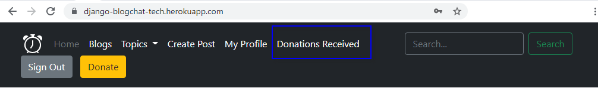
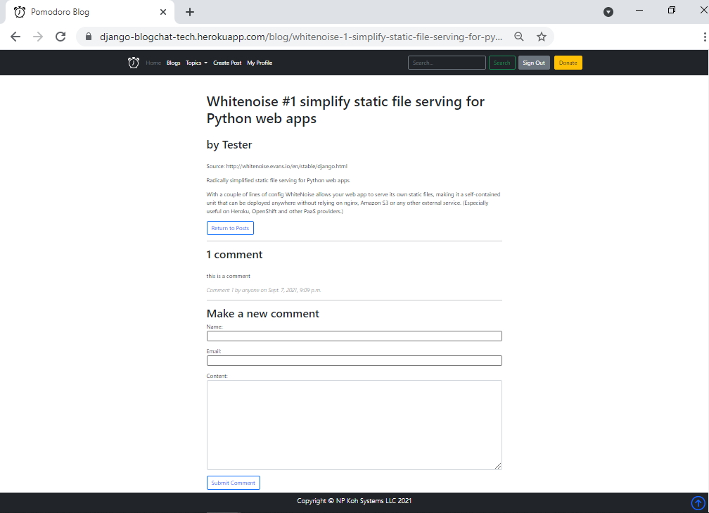
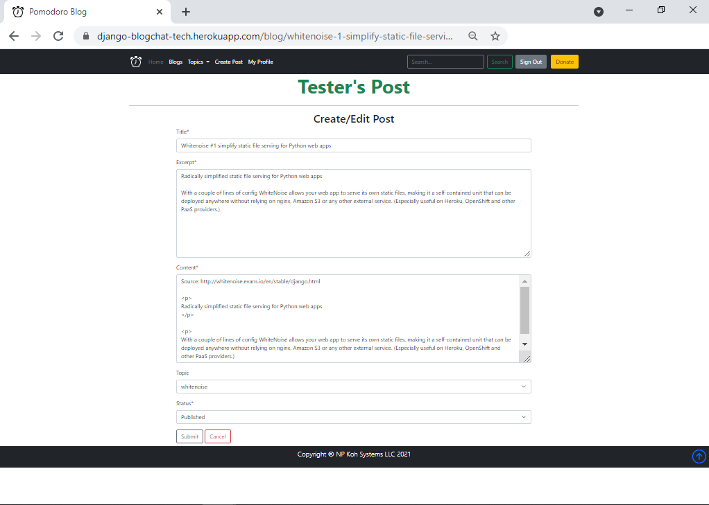
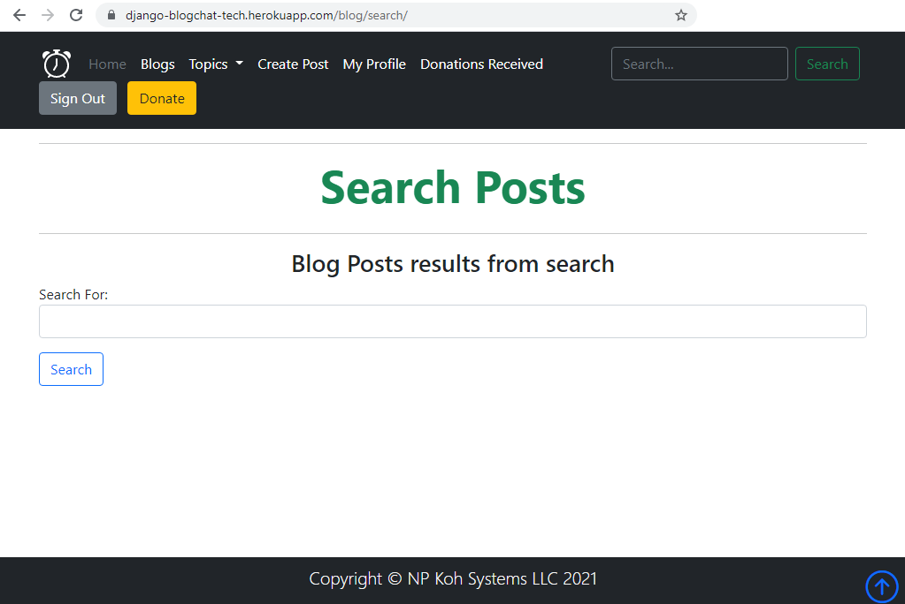
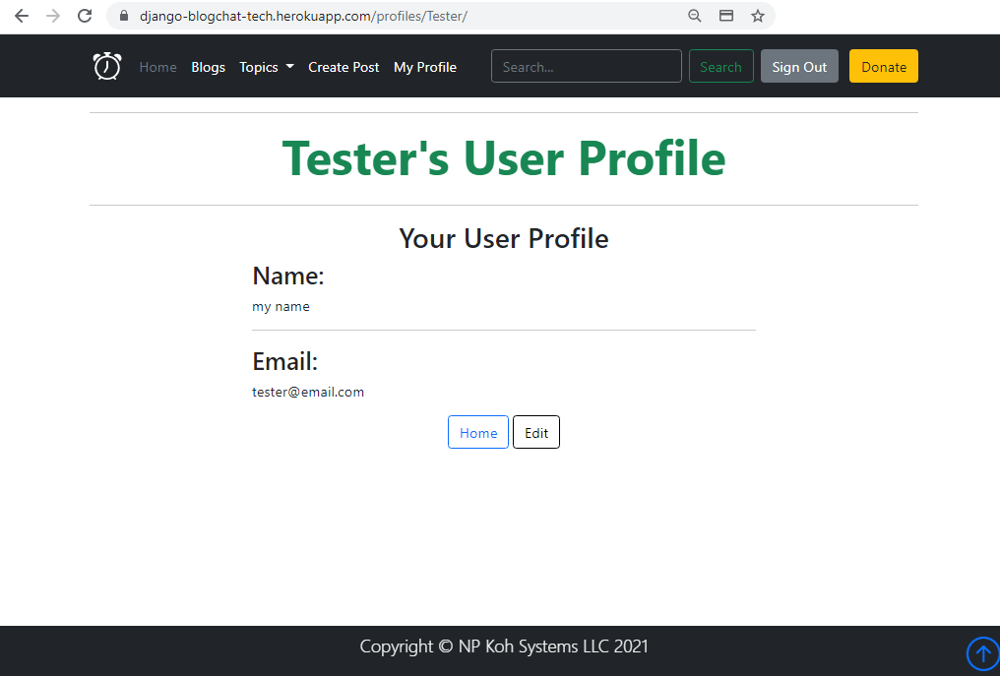
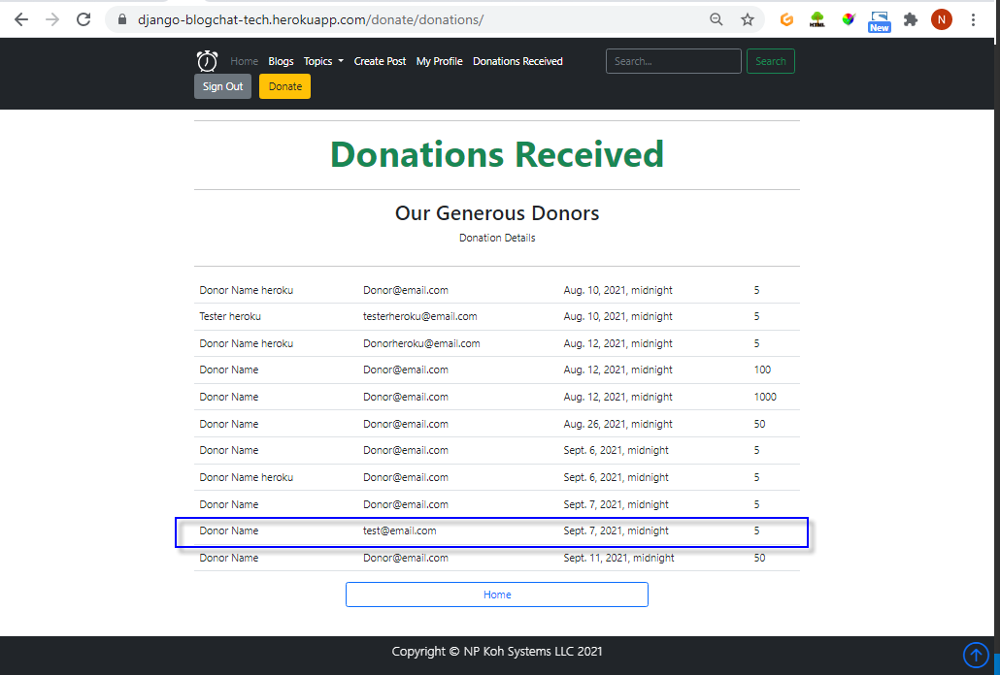

# Pomodoro Blog

[Click here access Pomodoro Blog](https://django-blogchat-tech.herokuapp.com/)


"Reading maketh a full man; conference a ready man; and writing an exact man." Francis Bacon

Pomodoro BlogChat is a site for users to read, converse and write about topics. Each blog entry focuses on a single concept.

The brain operates in two fundamental modes focus diffuse mode. Work with focus attention for 24 minutes and relax for 5 minutes. Practice slow thinking and exercise to increase the ability to learn and recall. Understanding combined with practice and repetition in a variety of circumstances to truly gain mastery.

The inspiration for this application came from Francis Bacon's quote and  [Barbara Oakley: Learning How to Learn](https://tedsummaries.com/2015/03/04/barbara-oakley-learning-how-to-learn/).

## Table of Content

- [User Experience Design (UX)](#user-experience-design--ux-)
- [Strategy Plane](#strategy-plane)
  * [Purpose](#purpose)
  * [Site Goals](#site-goals)
    + [Business Goals](#business-goals)
    + [User Goals](#user-goals)
    + [Blog Content](#blog-content)
  * [User Stories](#user-stories)
    + [Personas](#personas)
- [Scope Plane](#scope-plane)
  * [Planned Features](#planned-features)
    + [Mobile First responsive on all device sizes](#mobile-first-responsive-on-all-device-sizes)
    + [Overview Feature Page](#overview-feature-page)
    + [Blog Posts Display](#blog-posts-display)
    + [Blog Post Management CRUD](#blog-post-management-crud)
    + [Blog Posts Search](#blog-posts-search)
    + [Blog Post Comments](#blog-post-comments)
    + [User Authentication](#user-authentication)
    + [User Profile](#user-profile)
  * [Blog Application Administration](#blog-application-administration)
  * [Donation](#donation)
- [Future Features](#future-features)
  * [Live Chat Conversations](#live-chat-conversations)
  * [Contact Form](#contact-form)
  * [Donation Enhancements](#donation-enhancements)
  * [Blog Post Enhancements](#blog-post-enhancements)
  * [Blog Application Configuration, Administration and Data Management](#blog-application-configuration--administration-and-data-management)
- [Structure Plane](#structure-plane)
  * [Database Schema](#database-schema)
  * [Donate Apps](#donate-apps)
  * [Blog App](#blog-app)
  * [Profile App](#profile-app)
- [Security and Access Management](#security-and-access-management)
  * [Django Contrib and Allauth](#django-contrib-and-allauth)
- [Wireframes](#wireframes)
- [Views](#views)
- [Skeletal Plane](#skeletal-plane)
  * [Post Content](#post-content)
  * [Navigation and Access](#navigation-and-access)
    + [All User](#all-user)
    + [Authenticated user](#authenticated-user)
    + [Authenticated user with superuser privileges](#authenticated-user-with-superuser-privileges)
    + [Administrator](#administrator)
- [Surface Plane](#surface-plane)
  * [Color Scheme, Web Page Components](#color-scheme--web-page-components)
  * [Navigation](#navigation)
    + [Non Authenticated Users](#non-authenticated-users)
    + [Authenticated Users](#authenticated-users)
    + [Administrator with Superuser Privileges](#administrator-with-superuser-privileges)
    + [Django Administration with Superuser Privileges](#django-administration-with-superuser-privileges)
  * [Footer](#footer)
  * [Home Page](#home-page)
    + [Welcome Hero](#welcome-hero)
    + [Features](#features)
  * [Blog Posts](#blog-posts)
    + [Published Blog Posts](#published-blog-posts)
    + [Posts by Topic](#posts-by-topic)
    + [Post Details](#post-details)
  * [Post CRUD](#post-crud)
    + [Create/Edit Post](#create-edit-post)
  * [Create Post](#create-post)
  * [Edit Post](#edit-post)
    + [Update and Delete](#update-and-delete)
  * [Comments](#comments)
  * [Search](#search)
  * [Authentication](#authentication)
    + [Sign In](#sign-in)
    + [Sign Out](#sign-out)
    + [Sign Up](#sign-up)
    + [Verify Email](#verify-email)
    + [My Profile](#my-profile)
    + [User Profile Admin Panel](#user-profile-admin-panel)
    + [View](#view)
  * [Donation Payments using Stripe](#donation-payments-using-stripe)
    + [Stripe](#stripe)
    + [Stripe Test Payment](#stripe-test-payment)
  * [Admin Panel](#admin-panel)
    + [Blog](#blog)
    + [Donate](#donate)
    + [Profiles](#profiles)
  * [Features for Future Consideration](#features-for-future-consideration)
- [Technologies Used](#technologies-used)
  * [Languages Used](#languages-used)
- [Frameworks, Libraries & Programs Used](#frameworks--libraries---programs-used)
- [Testing](#testing)
- [Known Issues](#known-issues)
- [Deployment](#deployment)
- [Heroku Deployment](#heroku-deployment)
  * [Create Heroku Account and New App](#create-heroku-account-and-new-app)
  * [Set up Environment Variables](#set-up-environment-variables)
  * [Enable Automatic deployment](#enable-automatic-deployment)
  * [Local IDE In GitPod](#local-ide-in-gitpod)
    + [Gitpod Environment Setting](#gitpod-environment-setting)
    + [Git clone repo](#git-clone-repo)
    + [PIP Install](#pip-install)
    + [Run migration to create db.sqlite3 on VSCode](#run-migration-to-create-dbsqlite3-on-vscode)
  * [Run Server](#run-server)
  * [Login to Heroku](#login-to-heroku)
  * [Push and migrate database to Heroku](#push-and-migrate-database-to-heroku)
  * [Heroku or SQLite3 Seed Data](#heroku-or-sqlite3-seed-data)
- [Code](#code)
- [Content](#content)
- [References](#references)

- [Acknowledgments](#acknowledgments)
- [Disclaimer](#disclaimer)

## User Experience Design (UX)

## Strategy Plane

### Purpose

This site provides a community platform where learners can apply the approach by reading(focus-mode) a blog to learn, have a conversation(diffuse-mode) to understand, and posting a blog(practice to master) to share their understanding. Users will help each other learn.

A blog post will typically be an explanation of a concept or a how-to tip or trick. The idea is to apply the Pomodoro approach to focus the blog post on a small chunk of information that takes no longer than 25 minutes to digest.

A blog series in turn will consist of a playlist of blog posts. As coders, one of the most important skills is to break down a problem into components and write code in chunks to solve the problem.

Readers can ask the blog post author questions and participate in a discussion via comments.

### Site Goals

#### Business Goals

- Free blog platform that can be simply implemented and deployed. It can be easily extended using the Django framework
- The site follows the minimum viable product (MVP) approach to identify and implement basic features that users to improve their learning outcome
- The site owner can accept voluntary donations
- The application can be implemented and configured for their own use
- The administrator of the blog will have full administrative privileges to control user access and privileges and to audit and remove content that is inappropriate or offensive

#### User Goals

- Authenticated users will be able to reinforce learning by publishing post blogs and make comments
- Non authenticated users will be able to access blog post content and make comments

#### Blog Content

- The blog content will be categorized by topic
- The administrator will configure and maintain the list of topics for any subject
- Authors will use the title associate it with a blog series to build a collection of blogs

### User Stories

#### Personas

- Non-Authenticated User (Reader)
- Authenticated User (Post Author)
- Content Curator and Application Administrator
- Donor

| Use Case # | As Persona | Want to |
| --- | --- | --- |
| 1.1 | As a user | I want to know the purpose and how to use the blog |
| 1.2 | As a user | I want to view a list of features |
| 1.3 | As a user | I want to know how to use each feature |
| 1.4 | As a user | I want to navigate to each feature from the feature page |
| | |
| 2.1 | As a non-authenticated user | I want to be able to view a list of blog posts |
| 2.2 | As a non-authenticated user | I want to be able to view blog details |
| 2.3 | As a non-authenticated user | I can make submit a comment on a post |
| 2.4 | As an authenticated user | I want to be able to search for blogs|
| 2.5 | As a non-authenticated user | I want to be able to register an account |
| | |
| 3.1 | As an authenticated user | I want to be able to create a blog post |
| 3.2 | As an authenticated user | I want to be able to update my blog post |
| 3.3 | As an authenticated user | I want to be able to delete my blog post |
| 3.4 | As an authenticated user | I want to be able to set the status of my blog post |
| | |
| 4.1 | As a authenticated user | I can make submit a comment on a post |
| 4.2 | As an authenticated user | I want to be able to comment on a blog post |
| 4.3 | As an authenticated user | I want to be able to view a blog list
| 4.4  | As an authenticated user | I want to be view blog list by topic|
| 4.5 | As a non-authenticated user | I want to be able able to view blog details|
| 4.6 | As an authenticated user | I want to be able to search for blogs|
| 4.7 | As a non-authenticated user | I can comment on a post |
| | |
| 5.1 | As an authenticated user | I want to be able to login |
| 5.2 | As an authenticated user | I Want to be able to create my profile information |
| 5.3 | As an authenticated user | I want to be able to edit my profile information |
| | |
| 6.1 | As a user | I want to be able to make voluntary donations of any amount using a credit card |
| 6.2 | As a user, I want to be able to make secure payments
| | |
| 7.1 | As an administrator | I want to be able to create a user account |
| 7.2 | As an administrator | I want to be able to update a user |
| 7.3 | As an administrator | I want to be able to delete a user |
| 7.4 | As an administrator | I want to be able to manage the topic list |
| 7.5 | As an administrator | I want to be able to have CRUD privileges to curate blog posts |
| 7.5 | As an administrator | I want to be able to have CRUD privileges to curate comments |
| | |
| 8.1 | As a site owner | I want to accept donations to maintain the site |
| 8.2 | As a site owner | I want to be able to review donors information and donation amounts
| | |
| 9.1 | As a non-authenticated user | I cannot bypass the site's mechanisms to create and edit a blog |
| 9.2 | As a non-authenticated user | I cannot bypass site's mechanisms to view donation information |

## Scope Plane

### Planned Features

#### Mobile First responsive on all device sizes

The goal is to design the application to work on small screen sizes. The approach is to focus on what is necessary for rending and navigation.

#### Overview Feature Page

The feature page provides the user with information about the site. The page will render the description and a link to access each feature.

- Overview of the purpose of the application
- Feature Description
- Provide User with Instructions
- Navigation Links to Features

#### Blog Posts Display

The blog post page will render all posts by default. There will be an option to display posts by topic.
Each post will display the title and a link to navigate to view the details of the post.

All users will be able to view the blog.
Only authenticated users will be rendered buttons to update and delete posts owned by them.

- Blog List by Date
- Blog List by Topic
- Blog Detail

#### Blog Post Management CRUD

Only Authenticated users will be able to create, modify and publish posts that they share.

- Create a post
- Edit a post
- Delete a post
- Publish a post
- Unpublish a post - set status to "Draft"

#### Blog Posts Search

Users can use the search navigation form on the navigation bar to search for blogs using keywords.
Posts that contain one or more of the keywords entered will render a search results page.

At the bottom of the results page, there will be an option to perform a new search.

- Search posts using keywords in title, excerpt, and content fields.
- Users do not need to be authenticated to perform a search.

#### Blog Post Comments

Users will be able to add comments to each post on the post detail page.
The comments will be rendered below each post on the detail post page.

- A comment form will be rendered below each post for any user to submit a comment
- Users do not need to be authenticated to post comments

#### User Authentication

Users who wish to create and share posts need to sign up for an account for authenticated access.
Authenticated users will have the privileges to manage the post that they create.

- Account Sign Up
- Account Sign In
- Access to create post link on the navigation bar

#### User Profile

Authenticated users will have the option to enter an alternated name and email.
This information can be utilized in future enhancements as the user's preferred contact information.

- Create a profile
- Update a profiles

### Blog Application Administration

The application administrator with superuser privileges have full access to all the data using the Django Administrator panel.

- Manage user access
- Curate blog post
- Curate comments
- Access details of donations received
  
### Donation

- Accept donation using stripe payment
- Simple Accept payment of any amount available only in the US and Canada
- Record donor name, email, and amount of donations received

## Future Features

### Live Chat Conversations

- As an author, I want to be able to have a conversation with readers via live chat
- As a user, I want to be able to have group conversations with other readers and authors

### Contact Form

- Users can submit questions to the site owner
- Administrator can respond to questions submitted

### Donation Enhancements

- Automated email generation Thank You for Donations
- Dashboard to track and report donations received
- Donor Information Management

### Blog Post Enhancements

- Blog Topic Category Management
- Rating and reviews
- Blog post status management to include draft, publish and unpublish (status ="draft")
- Blog series playlist generation
- Blog Metrics Dashboard for author number of blogs and blog ratings by topic

### Blog Application Configuration, Administration and Data Management

- Application configuration dashboard
- Donation Management
- Data management dashboard

## Structure Plane

### Database Schema


### Donate Apps

- Donation

```
class Donation(models.Model):
    """
    A model to record donations
    """
    donor_name = models.CharField(max_length=50)
    donor_email = models.EmailField(max_length=2gi log --oneline
    54)
    donate_date =  models.DateTimeField(max_length=80,
                                      null=False, blank=False)
    amount = models.IntegerField(default=0) 
    donated =  models.BooleanField(default=True)

    def __str__(self):
        return self.donor_name

```

### Blog App

- Topic

```
class Topic(models.Model):

    options = {
        ('django', 'Django'),
        ('bootstrap5', 'Bootstrap5'),
        ('javascript', 'JavaScript'),
        ('sql', 'SQL'),
        ('whitenoise', 'Whitenoise'),
        ('stripe', 'Stripe')
    }

    class Meta:
        verbose_name_plural = 'Topics'

    name = models.CharField(max_length=254, choices=options, default='No Topic')
    friendly_name = models.CharField(max_length=254, null=True, blank=True)

    def __str__(self):
        return self.name

    def get_friendly_name(self):
        return self.friendly_name
```

- Post

```
class Post(models.Model):

    class Meta:
        verbose_name_plural = 'Posts'

    options = {
        ('draft', 'Draft'),
        ('published', 'Published'),
    }

    title = models.CharField(max_length=254)
    excerpt = models.TextField()
    slug = models.SlugField(max_length=250, unique_for_date='publish')
    publish = models.DateTimeField(default=timezone.now)
    author = models.ForeignKey(User, on_delete=models.CASCADE, related_name='blog_posts')
    content = models.TextField()
    status = models.CharField(max_length=10, choices=options, default='draft')
    topic = models.ForeignKey('Topic', null=True, blank=True, on_delete=models.SET_NULL)

    def get_absolute_url(self):
        return reverse('post_detail', kwargs={'slug': self.slug})

    def __str__(self):
        return self.title

# Code Source: Try Django 1.9 - 29 of 38 - SlugField
def create_slug(instance, new_slug=None):
    slug = slugify(instance.title)
    if new_slug is not None:
        slug = new_slug
    qs = Post.objects.filter(slug=slug).order_by("-id")
    exists = qs.exists()
    if exists:
        new_slug = "%s-%s" %(slug, qs.first().id)
        return create_slug(instance, new_slug=new_slug)
    return slug

def pre_save_post_receiver(sender, instance, *args, **kwargs):
    if not instance.slug:
        instance.slug = create_slug(instance)

pre_save.connect(pre_save_post_receiver, sender=Post)
```

- Comment

```

class Comment(models.Model):

    post = models.ForeignKey(Post, on_delete=models.CASCADE, related_name ="comments")
    name = models.CharField(max_length=50)
    email = models.EmailField()
    content = models.TextField()
    publish = models.DateTimeField(auto_now_add = True)
    status = models.BooleanField(default=True)

    class Meta:
        ordering = ("publish",)

    def __str__(self):
        return f"Comment by {self.name}"
    
```

### Profile App

- UserProfile

```
class UserProfile(models.Model):
    """
    A user profile model for maintaining user profiles
    """
    user = models.OneToOneField(User, on_delete=models.CASCADE)
    name = models.CharField(max_length=80,
                            null=True, blank=True)
    email = models.EmailField(max_length=70, blank=True, null=True, unique= True)

    def __str__(self):
        return str(self.name)
    
@receiver(post_save, sender=User)
def create_or_update_user_profile(sender, instance, created, **kwargs):
    """
    Create or update the user profile
    """
    if created:
        UserProfile.objects.create(user=instance)
    # Existing users: just save the profile
    instance.userprofile.save()

```

## Security and Access Management

### Django Contrib and Allauth

Django allauth is implemented to handle account management and authentication.

```
Integrated set of Django applications addressing authentication, registration, account management as well as 3rd party (social) account authentication
```

## Wireframes

<details>
    <summary> Click to expand!</summary>

**Note:**

```
The respective Mobile wireframes version of each web page listed will be similar in content to the Home Page Mobile Wireframe. The content stacked in a single column.
```

- Home Page


- Home Page Mobile


- Sign In 


- Register Page


- Profile Create


- Profile Update Delete


- Blog View Posts

 


- Blog Post Detail


- Blog Post Create


- Blog Post Edit Delete


- Blog Posts Search


- Blog Posts Comment


- Donate Page


- Donate Success


</details>

## Views

The views consist of a combination of function and Generic Class-Based views.  The following guide was the basis for making the decision where feasible.

Source:


## Skeletal Plane

### Post Content

Blog posts by a topic with the required fields

- Title
- Excerpt
- Content
- Comments(If available, will be displayed with the post)
- Comment form is rendered

### Navigation and Access

The navigation bar and links will be the primary mechanism for navigating to features.
Page links to navigate to pages to perform functions and return to the home page or display posts pages.

Navigation links will be rendered base on user authentication and user privileges.

#### All User

- Blogs
- Topics
- Search
- Comment
- Donate

#### Authenticated user

- Create, Update and Delete Posts associated with the user
- Create, Update and Delete user profile

#### Authenticated user with superuser privileges

- View Donation List

#### Administrator

- Full access via the Django Administration panel

## Surface Plane

The goal is to design the page layout and include page elements and links that are familiar. The user can figure out how to navigate the application and access featured intuitively with minimal instructions.

### Color Scheme, Web Page Components

A minimalist black and white page layout with a simple theme for a blog is the intent.
Bootstrap5 standard colors, components, CSS, and built-in responsive-without Sass customization and used to develop the web pages.

### Navigation

Access to features is rendered based on the user's session authentication.

#### Non Authenticated Users


#### Authenticated Users


#### Administrator with Superuser Privileges



#### Django Administration with Superuser Privileges


### Footer

A footer with a scroll to the top of the page link


### Home Page

#### Welcome Hero

- The hero section describes the unique purpose of a blog post that focuses on a single concept or task
- A button will render an example of a post with a series of related posts


#### Features

- Features accessible without authentication
  - View Blog Posts
  - Comment on a Post
  - Search for Post using keywords

- Instructions and Link to Features

  - Brief description of each feature and links


### Blog Posts

#### Published Blog Posts

- Post Titles and Excerpts with published status will be rendered sorted by published date
- Click on Post titles to view the post details
- Update or delete buttons will render for authenticated authors


#### Posts by Topic

- Select Topic to display posts
- Post Titles and Excerpts with published status will be rendered sorted by published date
- Click on Post titles to view the post details
- Update or delete buttons will render for authenticated authors


#### Post Details

- Post Detail page will render when the user click on post titles
- Post title, Content, and comments are displayed
- Button is available to navigate back to the Blog Posts page
- Comment form is available



### Post CRUD

Authors of posts require authentication to perform CRUD operations.

#### Create/Edit Post


### Create Post


### Edit Post



#### Update and Delete


### Comments

Authentication is not required to post comments.

- Click on the post title to render to post detail.
- View comments
- Enter comments


### Search

- Search Item on Navbar


- Search Post Results


- New Search



### Authentication

allauth form

#### Sign In


#### Sign Out


#### Sign Up


#### Verify Email


#### My Profile

Fields Values Inherit from Users
- e-mail Address
- User name 



#### User Profile Admin Panel


#### View

- Functions

### Donation Payments using Stripe

Stripe ensures Payment Card Industry compliance and secure communications that mean never have store credit card information and tokenized and handled by Stripe.

Utilize Charges API since donations are a simple charge not requiring custom payment flows and experiences.
Used by customers primarily in US/Canada not requiring SCA (Strong Customer Authentication)

#### Stripe


- [Django Stripe Payments Simplified with Donation Page](https://www.youtube.com/watch?v=oZwyA9lUwRk)


- [Accept a payment using Stripe Elements](https://stripe.com/docs/payments/accept-a-payment-charges)


#### Stripe Test Payment

- [Basic Test Card Numbers](https://stripe.com/docs/testing)




- Payment Card Element Utilize Stripe API

stripe.js

```
// Set your publishable key: remember to change this to your live publishable key in production
// See your keys here: https://dashboard.stripe.com/apikeys

// Get Stripe publishable key
fetch("/donate/config/")
.then((result) => {
  console.log("then result");
  return result.json(); })
.then((data) => {
  // Initialize Stripe.js
  const stripe = Stripe(data.publicKey);
  console.log("then data");

  var elements = stripe.elements();

  // Custom styling can be passed to options when creating an Element.
  var style = {
      base: {
        // Add your base input styles here. For example:
        fontSize: '16px',
        color: '#32325d',
      },
    };
    
  // Create an instance of the card Element.
  var card = elements.create('card', {style: style});

  // Add an instance of the card Element into the `card-element` <div>.
  card.mount('#card-element');

  // Handle real-time validation errors from the card Element.
  card.addEventListener('change', function(event) {
    var displayError = document.getElementById('card-errors');
    if (event.error) {
      displayError.textContent = event.error.message;
    } else {
      displayError.textContent = '';
    }
  });

  // Create a token or display an error when the form is submitted.
  var form = document.getElementById('payment-form');
  form.addEventListener('submit', function(event) {
    event.preventDefault();

    stripe.createToken(card).then(function(result) {
      if (result.error) {
        // Inform the customer that there was an error.
        var errorElement = document.getElementById('card-errors');
        errorElement.textContent = result.error.message;
      } else {
        // Send the token to your server.
        stripeTokenHandler(result.token);
      }
    });
  });

  function stripeTokenHandler(token) {
    // Insert the token ID into the form so it gets submitted to the server
    var form = document.getElementById('payment-form');
    var hiddenInput = document.createElement('input');
    hiddenInput.setAttribute('type', 'hidden');
    hiddenInput.setAttribute('name', 'stripeToken');
    hiddenInput.setAttribute('value', token.id);
    form.appendChild(hiddenInput);

    // Submit the form
    form.submit();
  }
});
```

Stripe References:

- [Accept a card payment with Stripe.js](https://www.youtube.com/watch?v=0oHjwz-WHcc)
- [Accept a payment - Create a PaymentIntent with Python](https://www.youtube.com/watch?v=Tgjwx-38Dic&t=0s)

### Admin Panel


#### Blog

- Comments


- Post


- Topics


#### Donate

- Donations


#### Profiles

- User Profiles


### Features for Future Consideration

- Implement a sort and filter function for post display
- Implement User profile update function

## Technologies Used

### Languages Used

- HTML5
- CSS
- Python
- Javascript

## Frameworks, Libraries & Programs Used

- Django
- SQLite3
- PostGres
- Bootstrap5
- Git
- GitHub
- Heroku
- Gitpod
- VSCode
- Stripe
- Balsamiq
- [Whitenoise with Django](http://whitenoise.evans.io/en/stable/django.html)
- [django-allauth](https://django-allauth.readthedocs.io/en/latest/)
- [django crispy forms](https://django-crispy-forms.readthedocs.io/en/latest/#)
- [django-bootstrap-v5](https://django-bootstrap-v5.readthedocs.io/en/latest/)
- [django OAuth signals](https://django-oauth-toolkit.readthedocs.io/en/latest/tutorial/tutorial_01.html)
- [Django Graphviz](https://django-extensions.readthedocs.io/en/latest/graph_models.html)
- [GitHub Wiki TOC generator](https://ecotrust-canada.github.io/markdown-toc/)

## Testing

[Testing Documentation here.](TESTING.md)

## Known Issues

- Refactor code to replace function views with class base views for consistent development standards for code maintainability
- Read-only profile name and email instead of duplicated fields associated with the user account

## Deployment

## Heroku Deployment

### Create Heroku Account and New App

- Setup a Heroku Account and Log In to Heroku
- Click on the New button on the Apps Page


- Enter an app name that is available and choose the region closest to you
- Click Create app


- Click on Resource tab Add-On Heroku Progres database
- Select a Development plan

### Set up Environment Variables

- DATABASE_URL
- EMAIL_HOST_PASS
- EMAIL_HOST_USER
- HEROKU_HOSTNAME
- SECRET_KEY
- STRIPE_PUBLIC_KEY
- STRIPE_SECRET_KEY

### Enable Automatic deployment

- Navigate to Deploy Tab
- Automatic Deployment section
- Choose target branch for deployment
- Enable automatic deployment

### Local IDE In GitPod

#### Gitpod Environment Setting

- Navigate to Gitpod Account Settings
- Click on Variable
- Create Environment Variables and populate using your values

```
DATABASE_UTL
DEVELOPMENT
SECRET_KEY
STRIPE_PUBLIC_KEY
STRIPE_SECRET_KEY
```

#### Git clone repo

```
git clone https://github.com/NgiapPuoyKoh/django-blogchat-tech.git repo
```
- In the terminal navigate to the project folder

#### PIP Install

- pip install -r requirements.txt

#### Run migration to create db.sqlite3 on VSCode

- python3 manage.py makemigrations --dry-run
- python3 manage.py showmigrations
- python3 manage.py migrate --plan  
- python3 manage.py migrate
- python manage.py createsuperuser

### Run Server

- python manage.py runserver

### Login to Heroku

- heroku login -i
- heroku apps:create django-blogchat-tech
- heroku apps
- git remote -v

### Push and migrate database to Heroku

```
git push heroku master
heroku logs --tail
heroku local web
heroku run python manage.py makemigrations --dry-run
heroku run python manage.py collectstatic --noinput heroku run python manage.py migrate --plan
heroku run python manage.py migrate
heroku run python manage.py createsuperuser
heroku run python manage.py showmigrations
```

### Heroku or SQLite3 Seed Data

- Topics

As superuser navigate to the Django Admin panel and create the topics


## Code

Code modified and utilized where applicable from sources cited in the reference section.

## Content

Post contents are created and may include link to online resources

## References

<details>
    <summary> Click to expand!</summary>

## Django

#### Django Framework

- [Python Django Crash Course 2021](https://www.youtube.com/watch?v=IHTP8-KskcQ&list=PLOLrQ9Pn6cax6x4UhfCGb24JqZOUl9qLL)
- [Django -Ecommerce Project](https://www.youtube.com/playlist?list=PLOLrQ9Pn6caxY4Q1U9RjO1bulQp5NDYS_)
- [Static vs. Media files in Django](https://browniebroke.com/blog/static-vs-media-in-django/)

#### Django Models

- [Django Model Inheritance Options Introduction - ORM Part-9](https://www.youtube.com/watch?v=4Xag2FzmN60&list=PLOLrQ9Pn6cayWzj2P3eQvnLxuPz1Q4R84&index=2)
- [Learn Django - Build a Custom User Model with Extended Fields](https://www.youtube.com/watch?v=Ae7nc1EGv-A&list=PLOLrQ9Pn6cayWzj2P3eQvnLxuPz1Q4R84)

#### Django Function and Generic Class-Based Views

- [Classy Class-Based Views](https://ccbv.co.uk/)
- [Class-Based Views vs. Function-Based Views](https://simpleisbetterthancomplex.com/article/2017/03/21/class-based-views-vs-function-based-views.html)
- [Django : Class-Based Views vs Function Based Views](https://medium.com/@ksarthak4ever/django-class-based-views-vs-function-based-view-e74b47b2e41b)

#### Django Packages

- [django-allauth](https://django-allauth.readthedocs.io/en/latest/installation.html#django)

#### Django Testing

- [Learn Django - Testing Series](https://www.youtube.com/playlist?list=PLOLrQ9Pn6cay7t8VZ3wmn6QdAxzTx60F3)
- [Writing and running tests¶](https://docs.djangoproject.com/en/3.2/topics/testing/overview/)
- [Django Tutorial Part 10: Testing a Django web application](https://developer.mozilla.org/en-US/docs/Learn/Server-side/Django/Testing)
- [Django Testing](https://www.youtube.com/watch?v=swEjbCW9XDY&list=PLOLrQ9Pn6cay7t8VZ3wmn6QdAxzTx60F3)
- [Django automated testing with GitHub Actions](https://www.youtube.com/watch?v=qJPLFDtEi1I)
- [Django Testing Tutorial - How To Set Up Tests And Testing URLs #1](https://www.youtube.com/watch?v=qwypH3YvMKc&list=PLbpAWbHbi5rMF2j5n6imm0enrSD9eQUaM)

#### Django Middleware

- [Django Middleware](https://www.youtube.com/watch?v=EpZOVmEw9Qg)

#### Django Transaction Atomicity

- [Django Transaction Atomicity](https://www.youtube.com/watch?v=BchP5Mn1IYg)

#### Django Blog

- [Django Project - Simple Blog App](https://www.youtube.com/watch?v=AF4ji8bb1M8&list=PLOLrQ9Pn6cawWd-5UZM6CIm0uqFXeBcTd&index=6)

#### Django Chat Rooms

- [Learn Django - Build an Asynchronous Chatroom with Django and Channels](https://www.youtube.com/watch?v=F4nwRQPXD8w)
- [Channels](https://channels.readthedocs.io/en/latest/tutorial/index.html)
- [Deploy Django + Channels + Redis + Heroku + Daphne](https://www.youtube.com/watch?v=zizzeE4Obc0)
- [Learn Django - Project Chatrooms](https://www.youtube.com/playlist?list=PLOLrQ9Pn6cazStWmb0DpaNgFz_RzKawo8)
- [Very Academy](https://www.youtube.com/channel/UC1mxuk7tuQT2D0qTMgKji3w)

#### Django Import CSV

- [Django Import CSV into Model](https://www.youtube.com/watch?v=vs6dXL9Wp7s)
- [Django Admin CSV file upload](https://www.youtube.com/watch?v=BLxCnD5-Uvc)

#### Django REST API

- [Building a REST API With Django REST Framework](https://www.digitalocean.com/community/tech_talks/building-a-rest-api-with-django-rest-framework?utm_medium=email&utm_source=webinar&utm_campaign=invite&mkt_tok=MTEzLURUTi0yNjYAAAF85bZZ8wSNtFocbKR05IVX1Bl8nXIYtU6og4yJUgFPeitI5vSTDpD0TxQ5jDkv_gXL-dDmi5l-0_HQ-AZEX90Xj1SRZqAAEg4VIosWW0Nu)

## Python

- [PEP 8 -- Style Guide for Python Code](https://www.python.org/dev/peps/pep-0008/#indentation)

## Bootstrap5

- [Bootstrap5 Docs](https://getbootstrap.com/docs/5.0/getting-started/introduction/)
- [Bookstrap5 Examples](https://getbootstrap.com/docs/5.0/examples/)
- [Bootstrap 5 Crash Course | Website Build & Deploy](https://www.youtube.com/watch?v=4sosXZsdy-s)

## Stripe

- [Django Stripe Payments Simplified with Donation Page](https://www.youtube.com/watch?v=oZwyA9lUwRk)
- [Accept a payment using Stripe Elements](https://stripe.com/docs/payments/accept-a-payment-charges)
- [Basic Test Card Numbers](https://stripe.com/docs/testing)
- [Accept a card payment with Stripe.js](https://www.youtube.com/watch?v=0oHjwz-WHcc)
- [Accept a payment - Create a PaymentIntent with Python](https://www.youtube.com/watch?v=Tgjwx-38Dic&t=0s)
- 
- [Stripe.js and Stripe Elements](https://stripe.com/docs/stripe-js)
- [Stripe Charges vs. Payment Intents APIs](https://stripe.com/docs/payments/payment-intents/migration/charges)
- [Stripe Integration security guide -PCI](https://stripe.com/docs/security/guide)
- [Stripe Development quickstart](https://stripe.com/docs/development/quicksta)
- [Stripe API Reference](https://stripe.com/docs/api/authentication)
- [Development Quick Start](https://stripe.com/docs/development/quickstart)
- [Django Stripe Subscriptions](https://testdriven.io/blog/django-stripe-subscriptions/)
- [Django Stripe Payments Simplified with Donation Page](https://www.youtube.com/watch?v=oZwyA9lUwRk)

## Heroku Deployment

- [Heroku & Django Deployment Guide](https://github.com/codingforentrepreneurs/Guides/blob/master/all/Heroku_Django_Deployment_Guide.md)

## Visual Studio Code

- [VS Code & Django - Tutorial](https://www.youtube.com/watch?v=IlmICfGQOv4)
- [DJANGO PROJECTS IN VISUAL STUDIO CODE](https://automationpanda.com/2018/02/08/django-projects-in-visual-studio-code/)
- [Visual Studio Code (Mac) - Setting up a Python Development Environment and Complete Overview](https://www.youtube.com/watch?v=06I63_p-2A4)
- [Visual Studio Code (Windows) - Setting up a Python Development Environment and Complete Overview](https://www.youtube.com/watch?v=-nh9rCzPJ20)
- [The VSCODE Checklist](https://dehlin.dev/blog/2019-07-25-the-vscode-checklist/)
- [Enable Windows 10 WSL](https://www.youtube.com/watch?v=5RTSlby-l9w)
- [Django Tutorial in Visual Studio Code](https://code.visualstudio.com/docs/python/tutorial-django)
- [25 VS Code Productivity Tips and Speed Hacks](https://www.youtube.com/watch?v=ifTF3ags0XI)

### VSCODE Extensions

- [SQLite Explorer]()
- [Postman API Test Alternative - Thunder Client](https://www.youtube.com/watch?v=L5GizgxMNQE)
- [Generate diagrams from Django models](https://www.youtube.com/watch?v=yvf_J225iM8)
- [Django Extensions for Visual Studio Code Setup](https://www.youtube.com/watch?v=PcvyZ3mIONM)

## Tools

- [Stack Overflow Developer Survey 2020](https://insights.stackoverflow.com/survey/2020)
- [graphviz](https://graphviz.org/)
- [django-extensions](https://django-extensions.readthedocs.io/en/latest/graph_models.html)
- [pip install django-extensions](https://pypi.org/project/django-extensions/)

## Markdown

- [readme.so](https://readme.so/editor)

## Git

- [Using Git in a team: a cheatsheet](https://jameschambers.co.uk/git-team-workflow-cheatsheet)
- [GitHub Wiki TOC generator](https://ecotrust-canada.github.io/markdown-toc/)
- [Django Secret Key Generator](https://miniwebtool.com/django-secret-key-generator/)

## Technologies References

- [Whitenoise](http://whitenoise.evans.io/en/stable/django.html) Serve static files
- [django-allauth](https://django-allauth.readthedocs.io/en/latest/overview.html#supported-flows)
Multiple authentication schemes and account verification
- [Amazon S3](https://testdriven.io/blog/storing-django-static-and-media-files-on-amazon-s3/
) Storing Django Static and Media Files on Amazon S3

## Media Sources

- [icon-icons](https://icon-icons.com/icon-packs-recently-uploaded)
- [Linea](https://linea.io/)
- [Google Fonts](https://fonts.google.com/?query=lato)
- [Font Awesome](https://fontawesome.com/kits/7d6112ed33/use)

## UX/UI

- [What Are Favicons: A Comprehensive Guide](https://sympli.io/blog/heres-everything-you-need-to-know-about-favicons-in-2020/)

## Analytics Dashboard

- [How to create an analytics dashboard in a Django app](https://www.freecodecamp.org/news/how-to-create-an-analytics-dashboard-in-django-app/)
- [Django for Data Science](https://justdjango.com/blog/django-for-data-science/)

## Learning how to learn (Chunking and Pomodoro Technique)

- [Helping Students be Excellent Online Learners](https://www.youtube.com/watch?v=AnQHToj1exY)
- [Learning how to learn](https://www.coursera.org/learn/learning-how-to-learn?)

</details>

## Acknowledgments

Thank you to my mentor Guido Cecilio for his guidance for this project. Thank you to the slack members who supported me as I persevere and navigate and overcome the obstacles of my Full Stack Software development journey.

## Disclaimer

The content of this website is for education purposes only.