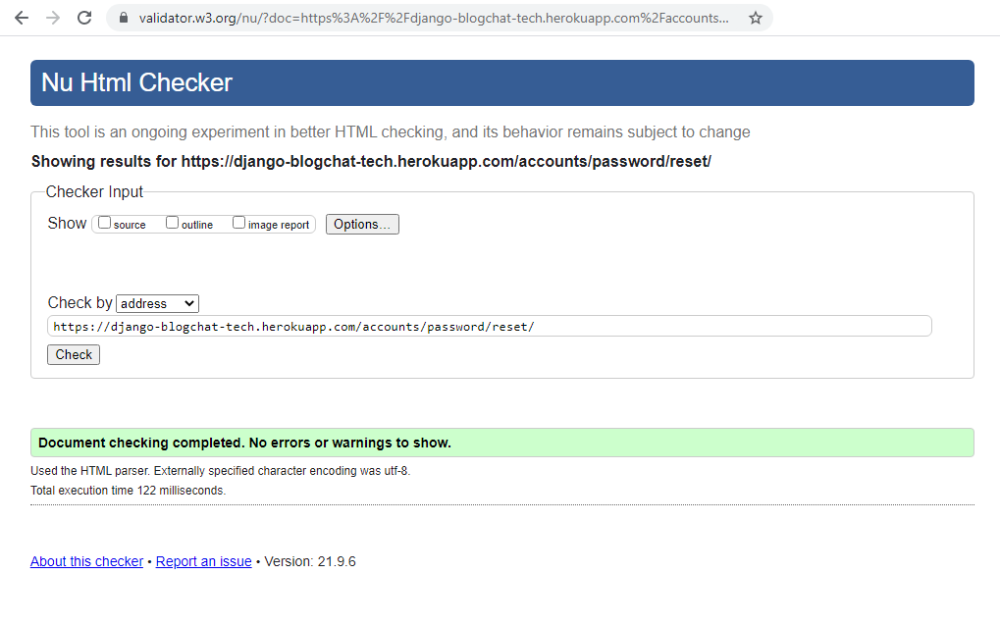

# Pomodoro Blog Testing

## Testing Notes

### Donation Stripe Testing

- Credit Card Number - 4242 4242 4242 4242
- MM/YY must be a future date
- CVC must be any 3-digits
- ZIP any valid 5-digit US Zip Code e.g. 02180

## Known Issues and Future Enhancements

### 403 renders when a user attempts to update a post not created by the user

- Handle by redirecting to the profile page

### User Profile generated when creating a user

- Rename user profile email to preferred email and prepopulate with user account email at the time of user account creation
- Enable profile update to include preferred email

## Table of Content

[Functional Features and User Stories Testing](#functional-features-and-user-stories-testing)
- [Navigation access by user authentication profile](#navigation-access-by-user-authentication-profile)
- [Display Posts by Topic](#display-posts-by-topic)
- [Post Detail Page](#post-detail-page)
- [Create, Update, Delete Blog Posts only by author and Administrator](#create-update-delete-blog-posts-only-by-author-and-administrator)
- [Comment on Post](#comment-on-post)
- [View a Blog Posts](#view-a-blog-posts)
- [Sign Up, Login, Sign Out, Profile](#sign-up-login-sign-out-profile)
- [Authentication Not required](#authentication-not-required)
- [Authentication as the author required to CRUD post](#authentication-as-the-author-required-to-crud-post)
- [Donations](#donations)
- [Stripe](#stripe)
- [Admin Panel Django Apps Models](#admin-panel-django-apps-models)
  * [Users](#users)
  * [Posts](#posts)
  * [Comments](#comments)
  * [User Profiles](#user-profiles)
  * [Admin Donations](#admin-donations)
- [Custom 404](#custom-404)
- [Mobile First Friendly](#mobile-first-friendly)
- [Mobile Device Responsive Pages](#Mobile-Device-Responsive-Pages)
- [Automated Testing and Test Driven Development](#automated-testing-and-test-driven-development)
- [Coverage Report](#coverage-report)
    + [Views](#views)
    + [Models](#models)
    + [Forms](#forms)
  * [Automated Test](#automated-test)
  * [Coverage Install and Commands](#coverage-install-and-commands)
  * [Donation Process](#donation-process-flow)
    + [Stripe Payment](#stripe-payment)
    + [Donation Workflow Steps](#donation-workflow-steps)
    + [Donation Form](#donation-form)
  * [Donation Captured](#donation-captured)
  * [Cancel Donation Prior to Submit](#cancel-donation-prior-to-submit)
- [Development Bugs and Resolutions](#development-bugs-and-resolutions)
  * [Deployment to Heroku with Whitenoise to serve static files does not recognize css files](#deployment-to-heroku-with-whitenoise-to-serve-static-files-does-not-recognize-css-files)
  * [STRIPE Form input field values not displaying in terminal output](#stripe-form-input-field-values-not-displaying-in-terminal-output)
  * [Stripe Forbidden (CSRF cookie not set.)](#stripe-forbidden--csrf-cookie-not-set-)
  * [Django Model - TypeError: __str__ returned non-string](#django-model---typeerror----str---returned-non-string)
  * [Django Model Test Foreign Key](#django-model-test-foreign-key)
  * [Django 'str' object has no attribute 'get' - Stack Overflow](#django--str--object-has-no-attribute--get----stack-overflow)
  * [Stripe Public Key Issue](#stripe-public-key-issue)
  * [admin.py Post model AttributeError](#adminpy-post-model-attributeerror)
  * [Donate model test warning timezone](#donate-model-test-warning-timezone)
- [Reverse resolution of URLs template tag syntax error](#reverse-resolution-of-urls-template-tag-syntax-error)
- [Final Check](#final-check)
  * [Web Page Chrome Lighthouse Validation](#web-page-chrome-lighthouse-validation)
  * [CSS Validator](#css-validator)
  * [JavaScript Validator](#javascript-validator)
  * [Python Validator](#python-validator)

## Functional Feature and User Stories Testing

Manual tests are organized in sections to cover user stories, Django apps features, application navigation, web pages and application workflow.

The use case numbers of the user stories documented in the [README.md](https://github.com/NgiapPuoyKoh/django-blogchat-tech/blob/master/README.md) are listed to test all user stories.

## Navigation access by user authentication profile

| Use Case # | As Persona | Want to | Expected Results | Pass/Fail |
| --- | --- | --- | ---| --- |
| 1.1 | As a user | I want to know the purpose and how to use the blog | Click on home link home page renders | Pass |
| 1.2 | As a user | I want to view a list of features | Click on Topic dropdown. Posts by topic rendered | Pass |
| 1.3 | As a user | I want to know how to use each feature | Click on home Page to view Feature Descriptions | Pass |
| 1.4 | As a user | I want to navigate to each feature page from the home page | Click on each feature link navigates to feature page | Pass |
| | | | |
| 2.1 | As a non-authenticated user | I want to be able to view a list of blog posts | Click on Blog nav item link to display posts | Pass |
| 2.2 | As a non-authenticated user | I want to be able to view blog details | Click on post title to navigate to post details | Pass |
| 2.3 | As a non-authenticated user | I can submit a comment on a post | Enter a comment and click submit. The comment will display below the post | Pass |
| 2.4 | As an authenticated user | I want to be able to search for blogs | Enter keyword(s) in the search form on the navbar. Search Post results rendered | Pass |

## Display Posts by Topic

| Use Case # | As Persona | Want to | Expected Results | Pass/Fail |
| --- | --- | --- | ---| --- |
| | As a user | I want to display blog post by topic | Click on the Topic Nav item and select a topic from the list. Render published post by topic | Pass |
| | As a non-authenticated user | I want to view a list of post excerpts by topic | Click on the Topic Nav item and select a topic from the list. Renders the list of published posts' excerpt by topic | Pass |
| | As an authenticated user | I want to display blog post by topic | Click on the Topic Nav item and select a topic from the list. Render post by topic includes posts in published and draft status with delete and update buttons created by the user | Pass |
| | As a user | I want to see a message when there is no post for a topic | Select a topic with no posts. A message "There are no available posts' will render | Pass|

## Post Detail Page

| Use Case # | As Persona | Want to | Expected Results | Pass/Fail |
| --- | --- | --- | ---| --- |
| | As a user | I want to view the post detail | Click on the post title and content will render | Pass |
| | As a user | I want to click on the button to return to post page | Click on Return to Posts button renders blog post page | Pass |

## Create, Update, Delete Blog Posts only by author and Administrator

| Use Case # | As Persona | Want to | Expected Results | Pass/Fail |
| --- | --- | --- | ---| --- |
| 3.1 | As an authenticated user | I want to be able to create a blog post | Click on Create Post nav item,  create page renders, enter fields values, select topic, and status values. A post is created with the values entered | Pass |
| 3.2 | As an authenticated user | I want to be able to update my blog post | Update content, click submit and post renders updated content | Pass |
| 3.3 | As an authenticated user | I want to be able to delete my blog post | Author of the post will have access to the delete button.  Click on the button to delete the post | Pass |
| 3.4 | As an authenticated user | I want to be able to set the status of my blog post | Select a status from the field list. The post status is changed successfully | Pass |

## Comment on Post

| Use Case # | As Persona | Want to | Expected Results | Pass/Fail |
| --- | --- | --- | ---| --- |
| 4.1 | As an authenticated user | I can make submit a comment on a post | Login as a user to select a post created by the user and enter a comment. The comment is saved | Pass|
| 4.2 | As an authenticated user | I want to be able to comment on a blog post created by someone else | Select a post created by someone else and enter a comment| Pass |
| 4.7 | As a non-authenticated user | I can comment on a post | Click on the title of a Post to render the detail page, enter a comment and submit. The comment will be rendered with the post | Pass |

## View a Blog Posts

| Use Case # | As Persona | Want to | Expected Results | Pass/Fail |
| --- | --- | --- | ---| --- |
| 4.3 | As an authenticated user | I want to be able to view a blog list | Click on Blogs and list of all published posts are rendered | Pass|
| 4.4  | As an authenticated user | I want to be view blog list by topic| Click on Topics and select a topic blogs for that topic will render | Pass |
| 4.5 | As a non-authenticated user | I want to be able able to view blog details | Do not login click on Blogs and list of all published posts will be rendered | Pass|
| 4.6 | As an authenticated user | I want to be able to search for blogs| Enter keyword on search item form on the navbar. Blogs for the topic will be rendered | Pass |

## Sign Up, Login, Sign Out, Profile

| Use Case # | As Persona | Want to | Expected Results | Pass/Fail |
| --- | --- | --- | ---| --- |
|  | As a non-authenticated user | I want to be able to Sign Up for an account | Click on the signup link on the login page.  Enter user credentials. An email verification confirmation page rendered| Pass |
| 5.1 | As an authenticated user | I want to be able to login | Click on login nav item, Enter credentials, Create Post, My Profile nav items will display on Navbar | Pass |
| 5.2 | As an authenticated user | I want to be able to create my profile information | User can enter name. Future Enhancement to allow updating additional profile fields| Pass |
| 5.3 | As an authenticated user | I want to be able to edit my profile information |  User can edit name. Future Enhancement to allow updating additional profile fields| Pass |
|  | As an authenticated user | I want to be able to view my profile information | Click on My Profile Nav item to render profile information | Pass |
| |As a user | I want to receive to confirm email address when I sign up for an account | email with to confirm email generated and sent to the user | Pass |

## Authentication Not required

| Use Case # | As Persona | Want to | Expected Results | Pass/Fail |
| --- | --- | --- | ---| --- |
| 9.1 | As a non-authenticated user | I cannot by-pass the site's mechanisms to create and edit a blog | Enter URL for edit post. Redirected to sign-in page | Pass |
| 9.2 | As a non-authenticated user | I cannot by-pass site mechanisms to view donation information | Enter url for donation list. Redirected to sign-in page | Pass |
| | As an authenticated user | I cannot by-pass site mechanisms to view donation information|  Redirected to user profile page | Pass |

## Authentication as the author required to CRUD post

| Use Case # | As Persona | Want to | Expected Results | Pass/Fail |
| --- | --- | --- | ---| --- |
| | Only author of the post has privileges to update post | Enter https://django-blogchat-tech.herokuapp.com/accounts/login/?next=/blog/add-post-via-form-heroku-1/update/ | User is re-directed to sign-in. If the did not create the post no update and delete buttons render with the post | Pass |

## Donations

| Use Case # | As Persona | Want to | Expected Results | Pass/Fail |
| --- | --- | --- | ---| --- |
| 6.1 | As a user | I want to be able to make voluntary donations of any amount using a credit card | Click on the donation button. Enter user information and credit card details and the donation amount. Click on the Donate button. A Success message will be rendered | Pass |
|  | As a user | I want to cancel a donation before processing | Click on the cancel button. A cancel confirmation message will be displayed to confirm donation was not processed the user| Pass |

## Stripe

| Use Case # | As Persona | Want to | Expected Results | Pass/Fail |
| --- | --- | --- | ---| --- |
| 6.2 | As a user I want to be able to make secure payments | The donate button will trigger processing of donation as a secure transaction via Stripe | Transaction will be processed by Stripe | Pass |
|  | As a user | I want to enter credit card info to make a donation | The credit card information will be validated and processed by Stripe. Check donations list to view transaction | Pass |

## Admin Panel Django Apps Models

### Users

| Use Case # | As Persona | Want to | Expected Results | Pass/Fail |
| --- | --- | --- | ---| --- |
| 7.1 | As an administrator | I want to be able to create a user account | Add user via Django Adminstration. User is created and signal triggers creation of user profile record | Pass |
| 7.2 | As an administrator | I want to be able to update a user | Update profile name and email of user successfully | Pass |
| 7.3 | As an administrator | I want to be able to delete a user | Delete user successfully | Pass |
| 7.4 | As an administrator | I want to be able to manage the topic list | Add seeded topic defined topic database table | Pass |

### Posts

| Use Case # | As Persona | Want to | Expected Results | Pass/Fail |
| --- | --- | --- | ---| --- |
| 7.5 | As an administrator | I want to be able to have CRUD privileges to curate blog posts | Able to perform CRUD operations for posts successfully | Pass |
| 7.6 | As an administrator | I want to be able to have CRUD privileges to curate comments | Able to perform CRUD operations for comments successfully | Pass |

### Comments

| Use Case # | As Persona | Want to | Expected Results | Pass/Fail |
| --- | --- | --- | ---| --- |
|    | As an administrator| I want to curate post comments via the Django Administration Panel. I can perform CRUD operations on comments | Able to perform CRUD operations for comments successfully |Pass |

### Admin Donations

| Use Case # | As Persona | Want to | Expected Results | Pass/Fail |
| --- | --- | --- | ---| --- |
| 8.1 | As a site owner | I want to accept donations to maintain the site | No authentication is required for users to donate using credit cards | Pass |
| 8.2 | As a site owner | I want to be able to review information on donors and donation amounts | Login with superuser credentials. Click on Donations received nav item. A table listing the donations will be displayed | Pass |

### User Profiles

| Use Case # | As Persona | Want to | Expected Results | Pass/Fail |
| --- | --- | --- | ---| --- |
|    | As an administrator| I want to manage user profiles in the Django Administration Panel. I can perform CRUD operations on user profiles | Able to perform CRUD operations for user profiles successfully |Pass |

## Custom 404

| Use Case # | As Persona | Want to | Expected Results | Pass/Fail |
| --- | --- | --- | ---| --- |
| | As a user | I want to be notified when accessing a resource that does not exist| Enter a URL for a post that does not exist https://django-blogchat-tech.herokuapp.com/blog/1/. A custom 404 page will render with a link to return to the home page | Pass |


## Mobile First Friendly

| Use Case # | As Persona | Want to | Expected Results | Pass/Fail |
| --- | --- | --- | ---| --- |
|  | As a user | I want to be able to navigate and access functions on a mobile device | User can navigate and operate all features intuitively| Pass |

## Mobile Device Responsive Pages

| Use Case # | As Persona | Want to | Expected Results | Pass/Fail |
| --- | --- | --- | ---| --- |
|  | As a user | I want to be able to use use the app on a mobile device to be able to access all features with responsive pages | Perform all operations on an iPhone6 without issues | Pass |

## Automated Testing and Test Driven Development

The workflow used is to write tests during code development. Limited by current knowledge the focus was on simple tests.

A total of 86% coverage was achieved.


## Coverage Report

#### Views


#### Models


#### Forms


### Automated Test

- coverage run manage.py test

```
Creating test database for alias 'default'...
System check identified no issues (0 silenced).
.......................................
----------------------------------------------------------------------
Ran 39 tests in 4.003s

OK
Destroying test database for alias 'default'...
```

### Coverage Install and Commands

- pip install coverage
- coverage run --source=blog,donate,home,profiles manage.py test
- coverage report
- coverage html
- generates htmlcov folder
- navigate to htmlconv with windows explorer
- open index.html using a browser

### Donation Process Flow

#### Stripe Payment

#### Donation Workflow Steps

- Navbar Donate Button renders Donate Page
- Redirect to Success Page
- Redirect to Error Page
- Cancel redirect to Donate Page

#### Donation Form

- Validate Form input values and Stripe Payment Token
- Form Input values matches values terminal output
- Add Customer
- Payment Transacted


- STRIPE Payment Created


- STRIPE Customer Transaction


- STRIPE Customer


### Donation Captured

- Donation transaction captured for display in the database
- Displays in Admin
- Displays on Donation List Page accessible only to Admin
- Display message when no donations
- Execute donation model and views tests

### Cancel Donation Prior to Submit


## Development Bugs and Resolutions

### Deployment to Heroku with Whitenoise to serve static files does not recognize css files

- Error: Console error during deployment to Heroku unable to access css static files

```
Refused to apply style from 'https://django-blogchat-tech.herokuapp.com/static/css/base.css' because its MIME type ('text/html') is not a supported stylesheet MIME type, and strict MIME checking is enabled.
```
- Root Cause: Static file not copied during deployment to Heroku
- Fix: Install, configure Whitenoise and deploy to heroku
  - Solution: After 3 days of AGONY
Resolution:
  - DISABLE_COLLECTSTATIC = 1 needs to be removed from heroku dashboard for static files to be copied and then replaced it after (probably need to do this when deploying to heroku each time)
  
  - Updated settings following instructions found on https://devcenter.heroku.com/articles/django-assets.
Created statisfiles folder with an empty staticfiles.txt

  ```
  STATIC_ROOT = os.path.join(BASE_DIR, 'staticfiles')
  # Extra places for collectstatic to find static files.    STATICFILES_DIRS = (os.path.join(BASE_DIR, 'static'),)
  ```

  - Included mimetypes in settings and type="test/css" in html
added to urls.py

  ```
  ] + static(settings.MEDIA_URL, document_root=settings.MEDIA_ROOT) \
    + static(settings.STATIC_URL, document_root=settings.STATIC_ROOT)
  ```

- References: 
  <details>
    <summary> Click to expand!</summary>
  - [Django staticfiles not found on Heroku (with whitenoise)](https://stackoverflow.com/questions/35507140/django-staticfiles-not-found-on-heroku-with-whitenoise)

  - [Django and Static Assets](https://devcenter.heroku.com/articles/django-assets)
  [Using WhiteNoise with Django](http://whitenoise.evans.io/en/stable/django.html)

  - [Understanding static files in Django + Heroku](https://vonkunesnewton.medium.com/understanding-static-files-in-django-heroku-1b8d2f003977)

  - [Static vs. Media files in Django](https://browniebroke.com/blog/static-vs-media-in-django/)

  - [Heroku static files not loading, Django](https://stackoverflow.com/questions/28961177/heroku-static-files-not-loading-django)

  - [CSS not loading wrong MIME type Django](https://stackoverflow.com/questions/35557129/css-not-loading-wrong-mime-type-django)

  - [Static Files on Heroku with Django and Whitenoise | Hiit Startup | Django Tutorial](https://www.youtube.com/watch?v=TgmeAN32Uvw)

  - [Serve Static Files with Whitenoise](https://www.youtube.com/watch?v=qSrJt3UD9xk)
  - [Managing static files (e.g. images, JavaScript, CSS)](https://docs.djangoproject.com/en/3.2/howto/static-files/)
  - [Django Static Files Settings](https://docs.djangoproject.com/en/3.2/ref/settings/#std:setting-STATICFILES_FINDERS)
</details>

### STRIPE Form input field values not displaying in terminal output

- Error: Only Stripe variables values are displaying in output

  ```
  [05/Jul/2021 06:07:43] "POST /donate/charge/ HTTP/1.1" 302 0
  [05/Jul/2021 06:07:43] "GET /donate/success/5/ HTTP/1.1" 200 3954
  C:\Users\user\Downloads\MS4PomodoroBlogChat\django-blogchat-tech\donate\views.py changed, reloading.
  Watching for file changes with StatReloader
  Performing system checks...

  System check identified no issues (0 silenced).
  July 05, 2021 - 06:08:02
  Django version 3.2.4, using settings 'django_blogchat_tech.settings'
  Starting development server at http://127.0.0.1:8000/
  Quit the server with CTRL-BREAK.
  [05/Jul/2021 06:08:05] "GET / HTTP/1.1" 200 5514
  [05/Jul/2021 06:08:11] "GET /donate/ HTTP/1.1" 200 5089
  Data: <QueryDict: {'csrfmiddlewaretoken': ['Hf0aFlNvrhtAmOdttDv0IRlgZ1P6RME5HBSXIDx4bHLPR4zDdasd6vIzrX5EIYtN'], 'stripeToken': ['tok_1J9oj3IpOT7SMB9HH9kY1rwS']}>
  Email: None
  [05/Jul/2021 06:08:29] "POST /donate/charge/ HTTP/1.1" 302 0
  [05/Jul/2021 06:08:29] "GET /donate/success/5/ HTTP/1.1" 200 3954
  ```

- Root Cause: Input did not include name attribute
  ```
  <input required type="text" id = "nickname"  placeholder="Your Name">
  ```
  
- Fix: include input element name attribute
  ```
  <input required type="text" id = "nickname" name = "nickname" placeholder="Your Name">
  ```
  
  ```
  Starting development server at http://127.0.0.1:8000/
  Quit the server with CTRL-BREAK.
  [05/Jul/2021 06:11:45] "GET / HTTP/1.1" 200 5514
  [05/Jul/2021 06:11:50] "GET /donate/ HTTP/1.1" 200 5138
  [05/Jul/2021 06:11:50] "GET /static/donate/js/stripe.js HTTP/1.1" 304 0
  Data: <QueryDict: {'csrfmiddlewaretoken': ['EjaOUESHr7yL1gmIfA8S5obPtlZ8OF89EF2BXWCgbxQ0wwISZ755t2y8VhfGFRXR'], 'nickname': ['Test Name'], 'email': ['test@email.com'], 'amount': ['50'], 'stripeToken': ['tok_1J9omcIpOT7SMB9HPoBXjSHo']}>
  [05/Jul/2021 06:12:10] "POST /donate/charge/ HTTP/1.1" 302 0
  [05/Jul/2021 06:12:10] "GET /donate/success/5/ HTTP/1.1" 200 3954
  ```

- References:
  - [Django MultiValueDictKeyError error, how do I deal with it](https://stackoverflow.com/questions/5895588/django-multivaluedictkeyerror-error-how-do-i-deal-with-it)

### Stripe Forbidden (CSRF cookie not set.)

- Error: Forbidden (CSRF cookie not set.): /donate/charge/

  ```
  System check identified no issues (0 silenced).
  July 12, 2021 - 14:11:20
  Django version 3.2.4, using settings 'django_blogchat_tech.settings'
  Starting development server at http://127.0.0.1:8000/
  Quit the server with CTRL-BREAK.
  [12/Jul/2021 14:11:23] "GET / HTTP/1.1" 200 5520
  [12/Jul/2021 14:11:41] "GET /donate/ HTTP/1.1" 200 5086
  [12/Jul/2021 14:11:41] "GET /static/css/headers.css HTTP/1.1" 200 466
  [12/Jul/2021 14:11:41] "GET /static/css/base.css HTTP/1.1" 200 264
  [12/Jul/2021 14:11:41] "GET /static/donate/css/donate.css HTTP/1.1" 200 100
  [12/Jul/2021 14:11:41] "GET /static/donate/js/stripe.js HTTP/1.1" 200 2083
  Forbidden (CSRF cookie not set.): /donate/charge/
  [12/Jul/2021 14:12:57] "POST /donate/charge/ HTTP/1.1" 403 2870
  Forbidden (CSRF cookie not set.): /donate/charge/
  [12/Jul/2021 14:15:40] "POST /donate/charge/ HTTP/1.1" 403 2870
  C:\Users\user\Downloads\MS4PomodoroBlogChat\django-blogchat-tech\donate\views.py changed, reloading.
  Watching for file changes with StatReloader
  Performing system checks...
  ```

- Root Cause: CSRF decorator required for Stripe view

- Fix: include input element name attribute

  ```
  @csrf_protect
  def charge(request):
      """ A view to process donation """
  ```

### Django Model - TypeError: __str__ returned non-string

- Error: TypeError: __str__ returned non-string (type NoneType)

- Root Cause: return self.name is a CharField 

```
class UserProfile(models.Model):
    """
    A user profile model for maintaining user profiles
    """
    user = models.OneToOneField(User, on_delete=models.CASCADE)
    name = models.CharField(max_length=80,
                            null=True, blank=True)
    email = models.EmailField(max_length=70,blank=True, null= True, unique= True)

    def __str__(self):
        return self.name
```
- Fix: str type needs to be explicit for self.name

```
    def __str__(self):
        return str(self.name)
```
Reference:
[Django __str__ returned non-string (type NoneType)](https://stackoverflow.com/questions/47121046/django-str-returned-non-string-type-nonetype/47263135)

### Django Model Test Foreign Key

- Error:
```
(venv) C:\Users\user\Downloads\MS4PomodoroBlogChat\django-blogchat-tech>python manage.py test profile.test_models  
System check identified no issues (0 silenced).
E
======================================================================
ERROR: test_models (unittest.loader._FailedTest)
----------------------------------------------------------------------
AttributeError: module 'profile' has no attribute 'test_models'
```

- Root Cause:  Did not create user object to be referenced
```
    @classmethod
    def setup(cls):
        UserProfile.objects.create( user= user, name='testuser',email='testemail@example.com' )
```

- Fix:  
```
    @classmethod
    def setup(cls):
        user = get_user_model().objects.create_user(
                username='testuser', email='testemail@example.com',
                password='secret')
        UserProfile.objects.create( user= user, name='testuser',email='testemail@example.com' )
```

Reference:
- [how to test a model that has a foreign key in django?](https://stackoverflow.com/questions/44604686/how-to-test-a-model-that-has-a-foreign-key-in-django)

- [How to pass data for OneToOneField when testing?](https://stackoverflow.com/questions/56721076/how-to-pass-data-for-onetoonefield-when-testing)

### Django 'str' object has no attribute 'get' - Stack Overflow

- Error:  
```
Reverse for 'user_profile' with no arguments not found. 1 pattern(s) tried: ['profiles/(?P<user>[^/]+)/$']
```

- Root Cause: Url pattern requires argument <str:user>
```
path('<str:user>/', views.user_profile, name='user_profile'),
```

- Fix :

```
response = self.client.get(reverse('edit_profile', kwargs = {'user': self.user}))
```

Reference:
- [Django Testing Tutorial - Testing Views #3](https://www.youtube.com/watch?v=hA_VxnxCHbo)
- [Views that are restricted to logged in users](https://developer.mozilla.org/en-US/docs/Learn/Server-side/Django/Testing)
- [Try DJANGO Tutorial - 34 - Django URLs Reverse](https://www.youtube.com/watch?v=JqbBGxDLQeU)
- [Django Testing Tutorial - How To Test Your Django Applications (Using The Unittest Module)](https://www.youtube.com/playlist?list=PLbpAWbHbi5rMF2j5n6imm0enrSD9eQUaM)

### Stripe Public Key Issue

- Error: Integration Error: Missing value for Stript(): apikey should be a string.


- Root Cause: 

The name of the public key was not the same in the stripe.js and view.py

- Fix:

```
// Get Stripe publishable key
fetch("/donate/config/")
.then((result) => {
  console.log("then result");
  return result.json(); })
.then((data) => {
  // Initialize Stripe.js
  const stripe = Stripe(data.publicKey);
  console.log("then data");
```

```
@csrf_exempt
def stripe_config(request):
    if request.method == 'GET':
        stripe_config = {'publicKey': os.environ.get('STRIPE_PUBLIC_KEY') }
        return JsonResponse(stripe_config, safe=False)
```

### admin.py Post model AttributeError

- Error: 
python manage.py runserver
```
AttributeError: 'Post' object has no attribute 'publish'
```

- Root Cause: 

  The field name publish_date is not the same as referenced by slug unique_for_date='publish'

- Fix:

  Change the field name publish_date to publish in model.y and admin.py

### Donate model test warning timezone

- Error:

```
(venv) C:\Users\user\Downloads\MS4PomodoroBlogChat\django-blogchat-tech>python manage.py test donate.test_models
Creating test database for alias 'default'...
System check identified no issues (0 silenced).
C:\Users\user\Downloads\MS4PomodoroBlogChat\django-blogchat-tech\venv\lib\site-packages\django\db\models\fields\__init__.py:1358: RuntimeWarning: DateTimeField Donation.donate_date received a naive datetime (2021-08-02 00:00:00) while time zone support is active.
  warnings.warn("DateTimeField %s.%s received a naive datetime "
.
----------------------------------------------------------------------
Ran 1 test in 0.006s

OK
Destroying test database for alias 'default'...
```

- Root Cause:
  Introduced timezone for the blog app model need to update for donate test 

- Fix:
  Modify test import timezone and replace datetime.date.today() with timezone.now()

## Reverse resolution of URLs template tag syntax error

- Error: TemplateSyntaxError at /blog/topic/javascript/ Could not parse the remainder: '=' from '='

- Root Cause: Syntax error passing url paramet
- Fix: 

  ```
  <div class="dropdown-menu dropdown-menu-dark" aria-labelledby="navbarDarkDropdownMenuLink">
    
      <a href="" class="dropdown-item">
      {{ topic.name|title }}
      </a>
    
  </div> 
  ```

Reference:
[Reverse resolution of URLs](https://docs.djangoproject.com/en/3.2/topics/http/urls/)

## Final Check

### Web Page Chrome Lighthouse Validation


- Accessibility


- Best Practices
  

### HTML Validate

- Blog Post


- Topic


- Post Delete


- User Profile


- Create Edit Post


- Sign Up


- Email Confirmation


- Sign In


- Sign Out


- Password Reset


- Email Confirmation


### CSS Validator

- Validated CSS file refer to github repo history

### JavaScript Validator

- Validated js file refer to github repo history

### Python Validator

- Validated python files refer to github repo history
